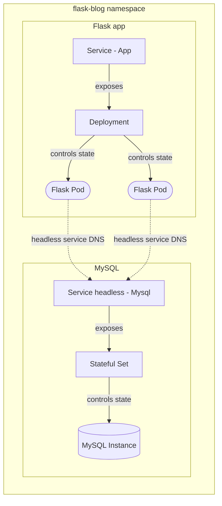

# Flask Blog Application on Kubernetes

Sample Flask app from documentation's tutorial, deployed on multi-node Kubernetes cluster using Kind.

Link to the Flask app on GitHub: https://github.com/pallets/flask/tree/main/examples/tutorial  
Link to the Flask app on Flask Documentation: https://flask.palletsprojects.com/en/2.2.x/tutorial/

The Application is being gradually moved from local setup to the container setup and finally, to the Kubernetes cluster.

## App setup

Application is modified to use external MySQL database instead of in-memory SQLite3.  
MySQL database instance is listening on port `3306` (default) and initialized by `db/schema.sql` file, which is responsible for creating the database, tables and user, used by Flask application.

## Separate Dockerfiles setup - v1.0.0

```bash
chmod +x scripts/deploy.sh
./scripts/deploy.sh \
    --network <network>
    --mysql <image_name>
    --password <mysql_root_password>
    --flask <image_name>
```

You can pass an additional `--prune` flag to remove all the existing resources, before provisioning new ones using the script.

## Docker Compose setup - v2.0.0

File `docker-compose.yaml` defined at root directory of the project can be used to deploy a containerized stack of Flask and MySQL instances.  
It works out the same way as `scripts/deploy.sh`, but with addition of automatic network creation, env variables resolution support, and health checks, as well as automatically restarting the containers on failure

To validate the compose file, with resolved environment variable:

```bash
docker-compose convert
```

To run a stack in _detached_ mode (including building any missing images):

```bash
docker-compose up --build -d
```

To remove stack and any related volumes/orphan containers:

```bash
docker compose down -v --remove-orphans
```

## Kubernetes Kind Cluster setup - v3.0.0

Kubernetes cluster consists of two worker nodes and one control-plane node, all running K8s v1.26.0, deployed using [Kind](https://kind.sigs.k8s.io/).  
The config file for Kind Cluster is defined in `kind-example-config.yaml`. You can create the cluster running `kind create cluster --config kind-example-config.yaml`.  
The following addition in the config file:  

```yaml
  extraPortMappings:
    - containerPort: 30423
      hostPort: 30423
      listenAddress: "0.0.0.0"
      protocol: TCP
```

Is required to be able to reach the pods via a _NodePort_ service type, which exposes the same port on worker node as defined in `hostPort` key-value pair. The Application does not have a Ingress Controller for managing external HTTP traffic, so it's the recommended way for reaching the service  

Alternatively, you can reach the pods behind a service by using `kubectl port-forward svc/<service name> <port on host>:5000`. You can then open the browser and visit `localhost:<port on host>`.  

The basic setups consists of **two** replicas of Flask application, which state is controlled by _Deployment Controller_, exposed by a _NodePort_ type service to the user.  
The Flask communicates with a MySQL instance through headless service, which exposes a Stateful Set, destined to manage the state of MySQL.



### Python Flask Blog App

You are able to reach the Flask Blog app by visiting _localhost_ on port exposed by the service (**30423**), which will go through NodePort on one o the worker nodes and reach the pod (**5000**).

```bash
curl localhost:30423 # or open browser and enter localhost:30423
```

All files used for deployment of the application are defined in `application/` folder:

* `config-maps.yaml` - Describes all non-secret related data that the app requires to function properly - this includes DNS of the MySQL service, init script for database or environment variables for defining database name and operating port.
* `secrets.yaml` - Describes all secret data that the app requires to function properly - this includes username and password of flask user, which will interact with MySQL database, root account credentials and secret keys.
* `namespace.yaml` - Describes the namespace in kubernetes cluster, in which all application resources are deployed.
* `services.yaml` - Describes two services for exposing pods matching certain labels - one for Flask app pods, second for MySQL instance respectively.
* `deplyoment.yaml` - Describes the Deployment Controller for managing state of Flask Blog pods.
* `stateful-set.yaml` - Describes the Stateful Set Controller for managing state of MySQL instance.

The order in which the infrastructure should be deployed is:  
**namespace -> config-maps & secrets -> services -> statefulset -> deployment**

It is possible to use `kubectl apply -f deployment/` to deploy all of them using single command, but the files are executed in **alphabetical order** (which may yield errors like trying to create resource in a namespace which is not yet created).

### EFK stack for logging

EFK stands for ElasticSearch (analyzing), Fluentd (collecting) and Kibana (visualizing). It's popular stack used to deploy standarized and centralized logging solution.

All of the above resources are deployed on a Kubernetes cluster and defined inside `logging/` directory:

* `config-maps.yaml` - Describes all *fluentd* configuration files, which are responsible for enriching logs with kubernetes metadata and sending them to elasticsearch
* `fluentd.yaml` - Deploys Fluentd as a daemon set, which runs on every node and collects logs from all the containers inside each pod
* `namespace.yaml` - Describes the namespace in kubernetes cluster, in which all logging resources are deployed.
* `elasticsearch.yaml` - Deploys ElasticSearch single node cluster for logs analytics
* `kibana.yaml` - Deploys single replica of Kibana for logs visualizing

Kubernetes plugin, already installed in Fluentd image for ElasticSearch, enriches the collected logs with additional kubernetes-related metadata, such as pod id, namespace, node name, image name etc.
